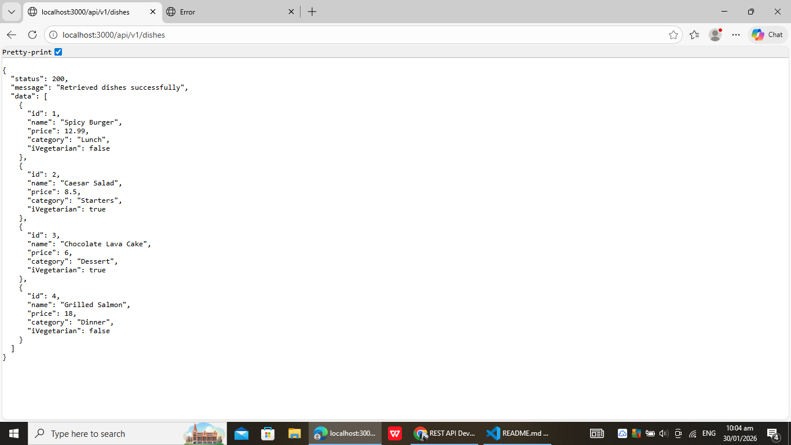

Markdown
# RESTful API Activity - Louise Angela Grace Regencia
## Best Practices Implementation
**1. Environment Variables:**  
- Why did we put `BASE_URI` in `.env` instead of hardcoding it?  
- Answer: We use `.env` to make the app flexible and secure. It allows us to change API versions or other configs without editing the code.

**2. Resource Modeling:**  
- Why did we use plural nouns (e.g., `/dishes`) for our routes?  
- Answer: Plural nouns represent collections of resources, making the API more RESTful and intuitive.

**3. Status Codes:**  
- When do we use `201 Created` vs `200 OK`?  
  - 201 Created: when a new resource is successfully created  
  - 200 OK: when a request succeeds but does not create a new resource  
- Why is it important to return 404 instead of just an empty array or generic error?  
  - 404 clearly informs the client that the resource does not exist, which helps with debugging.

**4. Testing:**  
- (Paste a screenshot of a successful GET request here)
 

- Why did I choose to Embed the Review?
  - I embedded the Review because each review belongs strictly to a specific Dish, and storing it inside the Dish makes it easy to retrieve and manage without needing a separate collection.

- Why did I choose to Reference the Chef?
  - I referenced the Chef because a Chef can exist independently of the Dish, and multiple dishes can share the same Chef. Using a reference keeps data normalized and avoids duplication.
