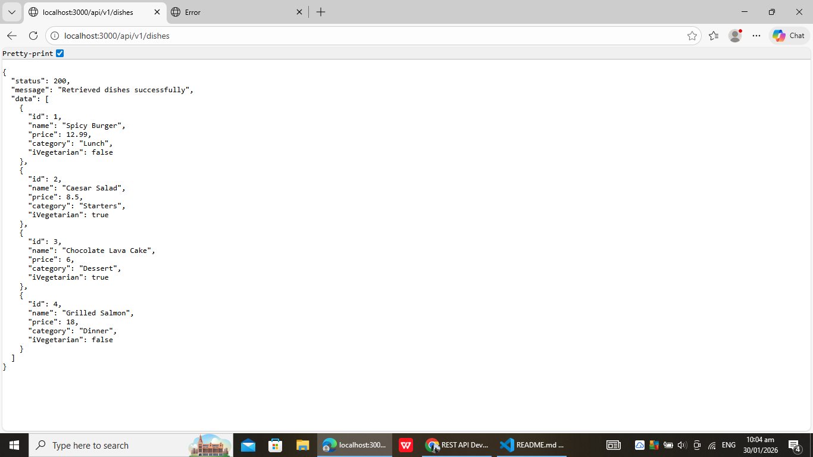

Markdown
# RESTful API Activity - Louise Angela Grace Regencia
## Best Practices Implementation
**1. Environment Variables:**  
- Why did we put `BASE_URI` in `.env` instead of hardcoding it?  
- Answer: We use `.env` to make the app flexible and secure. It allows us to change API versions or other configs without editing the code.

**2. Resource Modeling:**  
- Why did we use plural nouns (e.g., `/dishes`) for our routes?  
- Answer: Plural nouns represent collections of resources, making the API more RESTful and intuitive.

**3. Status Codes:**  
- When do we use `201 Created` vs `200 OK`?  
  - 201 Created: when a new resource is successfully created  
  - 200 OK: when a request succeeds but does not create a new resource  
- Why is it important to return 404 instead of just an empty array or generic error?  
  - 404 clearly informs the client that the resource does not exist, which helps with debugging.

**4. Testing:**  
- (Paste a screenshot of a successful GET request here)
 

- Why did I choose to Embed the Review?
  - I embedded the Review because each review belongs strictly to a specific Dish, and storing it inside the Dish makes it easy to retrieve and manage without needing a separate collection.

- Why did I choose to Reference the Chef?
  - I referenced the Chef because a Chef can exist independently of the Dish, and multiple dishes can share the same Chef. Using a reference keeps data normalized and avoids duplication.

  ### 1. Authentication vs Authorization 
  **Question:** What is the difference between Authentication and Authorization in our code? 
  
  **Answer:** 
    Authentication and Authorization are related but serve different purposes in our code. Authentication is the process of verifying the identity of a user. In our project, this happens in the login endpoint, where the system checks the user’s email or username and password to ensure they are who they claim to be. Authorization, on the other hand, determines whether an authenticated user has the right to access a specific route or resource. This is implemented in the protect middleware, which checks for a valid JWT token before granting access to protected routes, such as posting a new dish. In summary, authentication confirms identity, while authorization controls access. 
    
    ### 2. Security (bcrypt) 
    **Question:** Why did we use bcryptjs instead of saving passwords as plain text in MongoDB? 
    
    **Answer:** 
    We use bcryptjs to securely store passwords because saving them as plain text is very risky. If the database is ever compromised, plain text passwords could be stolen and misused, exposing sensitive user information. With bcryptjs, passwords are hashed before being saved in MongoDB. When a user logs in, the hashed password is compared with the stored hash to verify their identity without exposing the actual password. Hashing ensures that even if someone gains access to the database, the passwords remain unreadable and protected, greatly improving the security of our application. 
    
    ### 3. JWT Structure 
    **Question:** What does the protect middleware do when it receives a JWT from the client? 
    
    **Answer:** The protect middleware checks the Authorization header for a JWT token when a client requests access to a protected route. If a token is present, the middleware verifies it using the server’s secret key. Once verified, it retrieves the user information from the token and attaches it to the request object as req.user, allowing the request to continue to the route controller. If the token is missing, invalid, or expired, the middleware responds with a 401 Unauthorized error. This ensures that only authenticated and authorized users can access protected resources in our application.

  